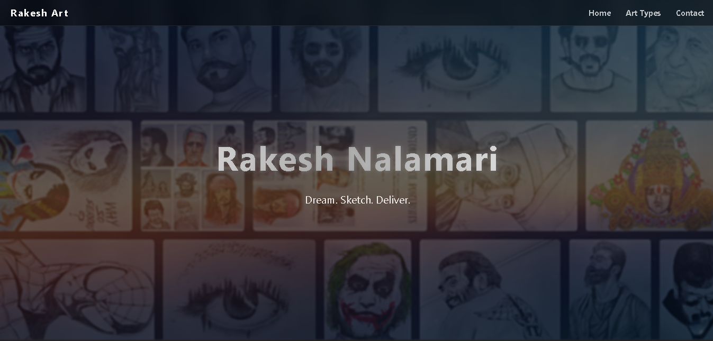
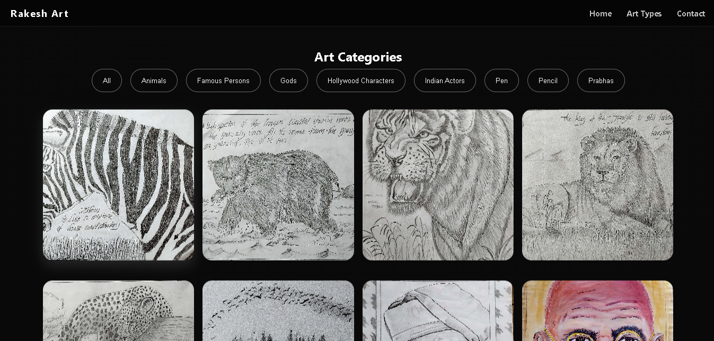
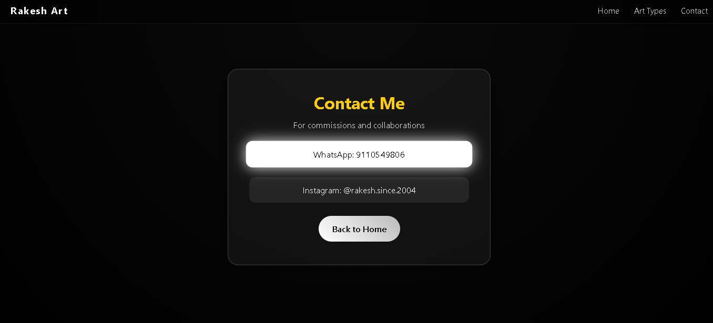

# 🎨 Rakesh Art Portfolio

Welcome to my Art Portfolio website!  
This is my personal website where I showcase my pencil and pen artworks with a modern, interactive design.

---

# 🌟 Website Preview

## 🏠 Home Page

---

## 🖼️ Art Categories

---

## 📬 Contact Page

---

# ✨ Features

- 🖼️ Art gallery with category filters  
- 🔍 Lightbox image preview  
- 🎯 Smooth hover & animation effects  
- 📱 Fully responsive (mobile-friendly)  
- 🎨 Modern dark-themed UI  
- 📂 Organized artwork categories  

---

# 🗂️ Folder Structure

project/
│
├── index.html
├── gallery.html
├── contact.html
├── style.css
├── script.js
│
├── home.png
├── art_categories.png
├── contact.png
│
└── images/
├── Animals/
├── Famous_Persons/
├── Gods/
├── Hollywood_Characters/
├── Indian_Actors/
├── Pen/
├── Pencil/
└── Prabhas/

---

# 🚀 Live Demo

(https://rakeshnalamari.github.io/Art-Portfolio/)

---

# 🛠️ Built With

- HTML5  
- CSS3  
- JavaScript  

---

# 👨‍🎨 About Me

Hi, I'm **Rakesh Nalamari** — an artist and aspiring web developer.

I specialize in:

- Pencil sketches  
- Pen art  
- Realistic portraits  
- Mythological art  
- Celebrity drawings  

I love combining **art + technology** to create beautiful web experiences.

---

# 📬 Contact

For commissions or collaborations:

- WhatsApp: 9110549806  
- Instagram: @rakesh.since.2004  

---

# ⭐ Support

If you like my work:

- Star this repository  
- Share with friends  
- Follow for more art updates  

---

# 📜 License

This project is for personal portfolio use.  
Artwork © Rakesh Nalamari.

Please do not reuse without permission.
